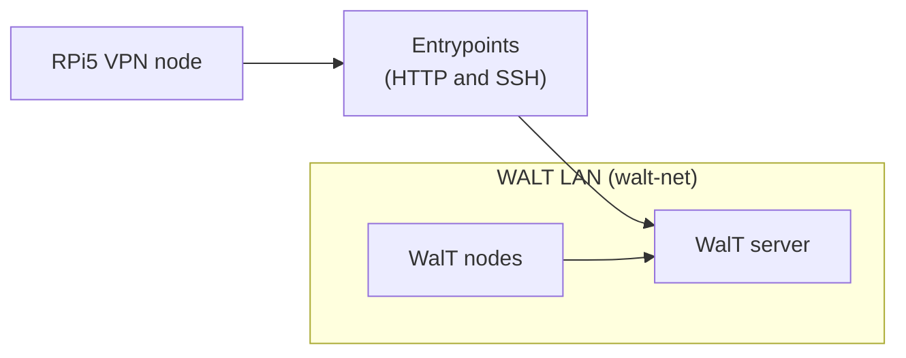
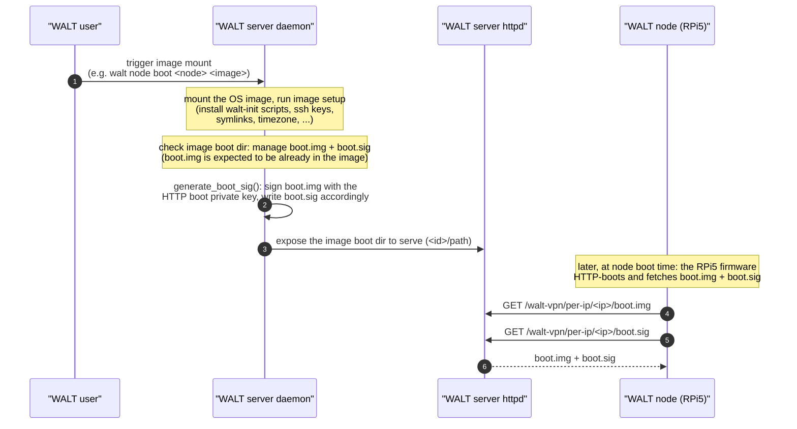
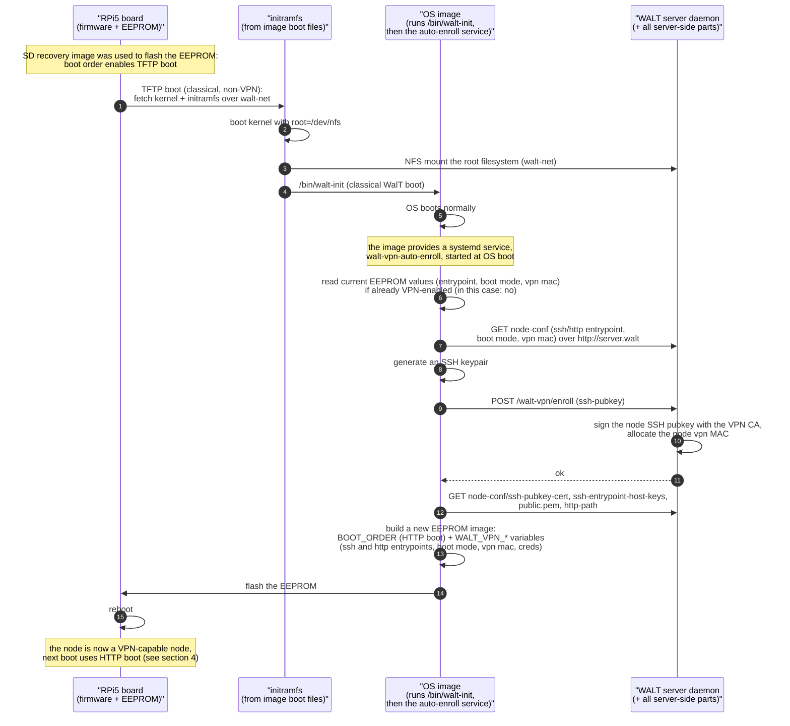
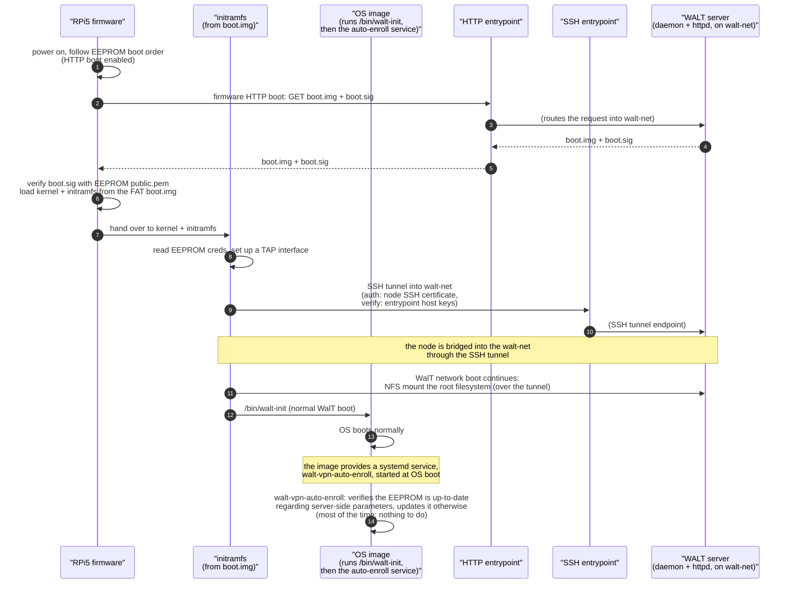

# How WALT VPN nodes (RPi 5B) boot

This topic describes how a WALT VPN-capable Raspberry Pi 5B boots, how the
server prepares and exposes the boot material, and how an RPi5 gets enrolled as
a VPN node.

Key source references (WALT server):
- `server/walt/server/mount/setup.py` → `generate_boot_sig()`, `setup()`
- `server/walt/server/exports/exports.py`, `server/walt/server/exports/ops/mounts.py`
- `server/walt/server/processes/main/network/tftp.py`
- `server/walt/server/services/httpd/httpd.py`
- `server/walt/server/processes/main/vpn.py` → `enrollment()`
- `server/walt/server/setup/vpn.py`

The *OS-image* side of the mechanism (enrollment service, `boot.img`
maintenance) is covered in the `walt-images` repository (section 6).

## 1. Deployment context

A WalT server manages the local platform LAN called **walt-net**. WALT nodes
can be located inside that LAN, or physically moved to distant sites and
connected through the Internet / a corporate network. In the latter case
a node does not reach the WalT server directly: it goes through small,
hardened **entrypoints** (an HTTP and an SSH entrypoint) which bridge
it into the walt-net.

### Where can an RPi5 node boot and how?

An RPi5 always boots to a WalT OS image served by the server, and its root
filesystem is mounted over NFS. What differs between cases is only **how the
node fetches its kernel/initramfs and how it reaches the walt-net** in the
first place; once the root filesystem is mounted, the rest of the boot is
identical for all cases.

| Node & context | What happens |
|----------------|--------------|
| Not VPN-enabled / not yet enrolled (must be on the walt-net) | classical TFTP boot from the walt-net; if the image provides the enrollment service, the node enrolls (section 3). |
| VPN node, physically on the walt-net | boots directly from the server, **no tunnel** (it is already in the walt-net: permissive mode may use classical TFTP, enforced mode uses HTTP boot); the walt-net identity is verified first. |
| VPN node, outside the walt-net | HTTP-boots, then opens an **SSH tunnel** through the entrypoints to reach the walt-net and mount its rootfs. |

Details of the TFTP/HTTP start and of the tunnel setup are given in
sections 3 and 4. The distinction between "VPN boot mode" (a global WALT server
setting) and the board "boot order" (a standard Raspberry Pi firmware setting)
is clarified in section 5.

## 2. Boot files: prepared, signed, and served

One OS image is used for all RPi models it supports. For an RPi5 to boot over
HTTP, the image's boot directory must contain `boot/rpi-5-b/boot.img` (a FAT
archive) and a `boot.sig` (its signature). This section shows how the WALT user,
the server daemon, the server httpd, and the WALT node interact to prepare,
sign, and serve these two files.

Notes:

- `boot.img` is a FAT-formatted file archive containing the same kind of files
  a Raspberry Pi finds on its SD card (kernel, initramfs, config, ...). As it
  is fetched over HTTP, it **must contain no secret**.
- `boot.sig` is the RSA signature of `boot.img`. The signature is computed
  **once when the image is mounted** and stored as a static `boot.sig` next to
  `boot.img` (`generate_boot_sig()`, `mount/setup.py`). The firmware does not
  re-sign; it only verifies.
- The HTTP boot keys are an RSA-2048 key pair at
  `/var/lib/walt/http-boot/private.pem` + `public.pem` (generated by the
  server; see `const.py`). `public.pem` is what the board ultimately stores in
  its EEPROM to verify `boot.sig`.
- The `boot.img` FAT file itself is maintained by the **OS image** (see
  section 6), not by the server. The server only signs whatever `boot.img` is
  present.

## 3. First boot of an RPi5 and VPN enrollment

For an RPi5 to become a VPN-capable node it must be booted **at least once on
the walt-net** using the classical (non-VPN) WalT boot procedure. Being
*inside* the walt-net is what lets it reach the server and complete
enrollment.

Please note: before enrollment, the node **is not able to HTTP-boot**. Like any
non-VPN-capable board, it starts by **TFTP booting** from the walt-net.

To prepare a brand-new board, one first flashes it (e.g. with the WalT
SD-card recovery image). Doing so **resets the board's EEPROM boot order**,
enabling the **TFTP boot** method, so the board can boot using the classical
WalT boot procedure from the walt-net.

The SSH entrypoint and the HTTP entrypoint are both written to the EEPROM, as
two distinct host names — they may be the same machine or different machines.

## 4. VPN boot of an RPi5 (subsequent boots)

Once enrolled, at every boot the RPi5 *HTTP-boots* `boot.img` + `boot.sig`,
and then opens an SSH tunnel through the SSH entrypoint so that the regular
WalT network boot (NFS root) can continue over the walt-net.

### The initramfs boot script

Deciding what to do at boot is handled *inside* the initramfs, which is part of
the OS image. The kernel command line carries `boot=walt`, so the initramfs
uses the WalT boot script (provided by the image, `scripts/walt` +
`scripts/walt-premount` under `overlays/debian/`). The script:

1. configures networking (DHCP);
2. decides whether to use the VPN, only if the image ships a VPN client
   (`scripts/walt-vpn-client`, i.e. the image is VPN-capable) **and** the board
   is VPN-enabled (EEPROM contains a `WALT_VPN_MAC`):
   - if the local network is detected as a walt-net (DHCP DNS domain `walt`)
     *and* the boot mode is **permissive**, the node simply boots classically,
     without the tunnel;
   - otherwise (VPN enabled), if it is already on a walt-net it first verifies
     securely that it really is the WalT network (`walt-vpn-client
     --check-server`), then bypasses the tunnel but reconfigures its interface
     with the VPN MAC; if it is *not* on a walt-net, it establishes the SSH
     tunnel via `walt-vpn-client`;
3. then mounts the root filesystem (NFS) and runs `/bin/walt-init`.

Whether the firmware may fall back to a classical TFTP boot when the HTTP boot
fails is governed by the EEPROM boot order, which derives from the global VPN
boot mode (section 5).

## 5. VPN boot mode versus board boot order

These two notions are related but distinct:

- **VPN boot mode** (`enforced` / `permissive`) is a **WALT server setting,
  global** (i.e. the same for all VPN-capable nodes), managed server-side by
  `walt-server-setup`.
- **Boot order** is a **standard Raspberry Pi firmware setting**, stored in the
  EEPROM, that lists the boot methods the firmware is allowed to try (SD card,
  TFTP, HTTP boot, ...).

They are connected through the EEPROM programming: the global VPN boot mode is
translated into a **global boot-order configuration** that is flashed into the
EEPROM of every VPN-capable RPi5 node:

- **enforced** → signed HTTP boot only (`BOOT_ORDER = 0xf7`), no fallback;
- **permissive** → HTTP boot, then TFTP, then SD card (`BOOT_ORDER = 0xf127`).

The EEPROM is (re)flashed at enrollment (section 3) and again whenever VPN
settings change on the server; the firmware then uses the boot order at each
power-on.

## 6. What the OS image must provide

A nontrivial part of the boot procedure lives **inside the OS image**: the
initramfs is part of the image, and so are the boot files and the enrollment
service. This means the OS image is not a passive payload — it must be built
with RPi5 VPN support.

The default WalT OS images for RPi5 nodes (`rpi64-debian`) are built from the
`walt-images` repository (Dockerfile `base/rpi64/debian/Dockerfile`, overlay
`overlays/rpi64-debian`). Concretely, the image contributes:

- **A systemd service** `walt-vpn-auto-enroll.service`
  (`overlays/rpi64-debian/etc/systemd/system/...`, script
  `usr/bin/walt-vpn-auto-enroll`). Started once the OS is booted, it performs
  enrollment (section 3) and re-flashes the EEPROM when VPN settings change
  (section 5). It runs only on real hardware, not in `walt image shell`.
- **`/boot/update-boot-files.sh`** (`overlays/rpi64-debian/boot/...`), which
  builds the `boot.img` FAT archive for HTTP boot from the RPi boot files, and
  keeps it up to date:
  - at image build time, to produce the shipped image;
  - automatically, so that when a WALT user modifies a running OS image (e.g.
    with `walt image shell <image>` then `apt upgrade` to change the kernel or
    initramfs, or edits boot files in `<image>:/boot/rpi-5-b/`), `boot.img` is
    regenerated to reflect those changes without the user needing to know about
    the mechanism. When such an updated image is later mounted, the server
    (re)signs it (section 2).
- **Boot files** under `<image>:/boot/rpi-5-b/` (kernel, initramfs, firmware
  config, `cmdline`...), gathered into `boot.img`. These boot files are not
  specific to VPN boot: they are also needed for the classical (non-VPN) TFTP
  boot procedure. The same kind of files are found in the boot directory of
  non-VPN-capable models, e.g. `<image>:/boot/rpi-3-b-plus/`.
- **Initramfs boot scripts** selected by `boot=walt` in `cmdline.txt`:
  `scripts/walt` (+ `scripts/walt-premount`) and, on the RPi5, the VPN client
  scripts `scripts/walt-vpn-client` / `scripts/walt-vpn-tools` (decision logic
  described in section 4).

Because an important part of the mechanism lives inside the OS image, some
third-party or more minimalistic WALT images may **not** support RPi5 VPN
booting. Such an image can still be booted **from the walt-net**
(classical TFTP boot); it just does not provide the HTTP boot / enrollment /
tunnel pieces described above.
