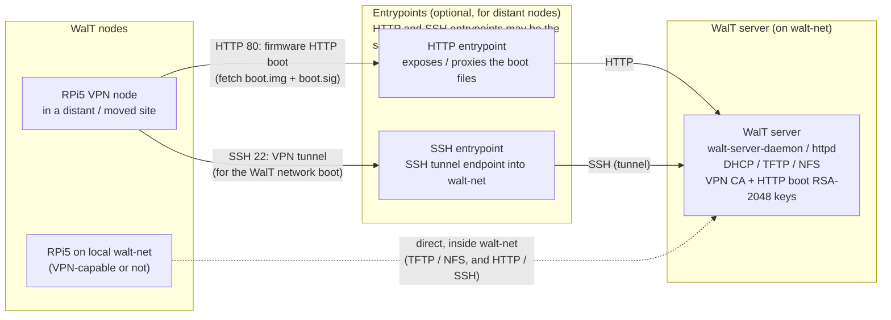
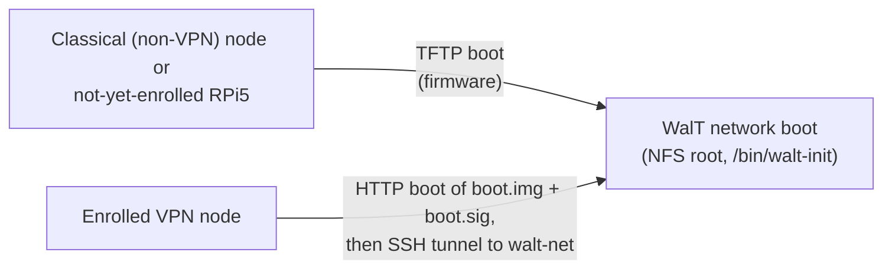
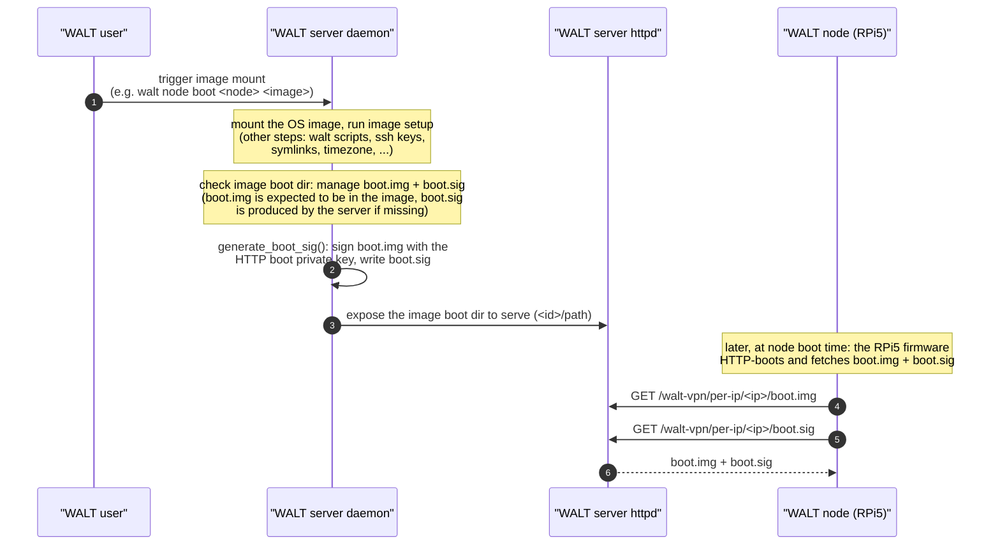
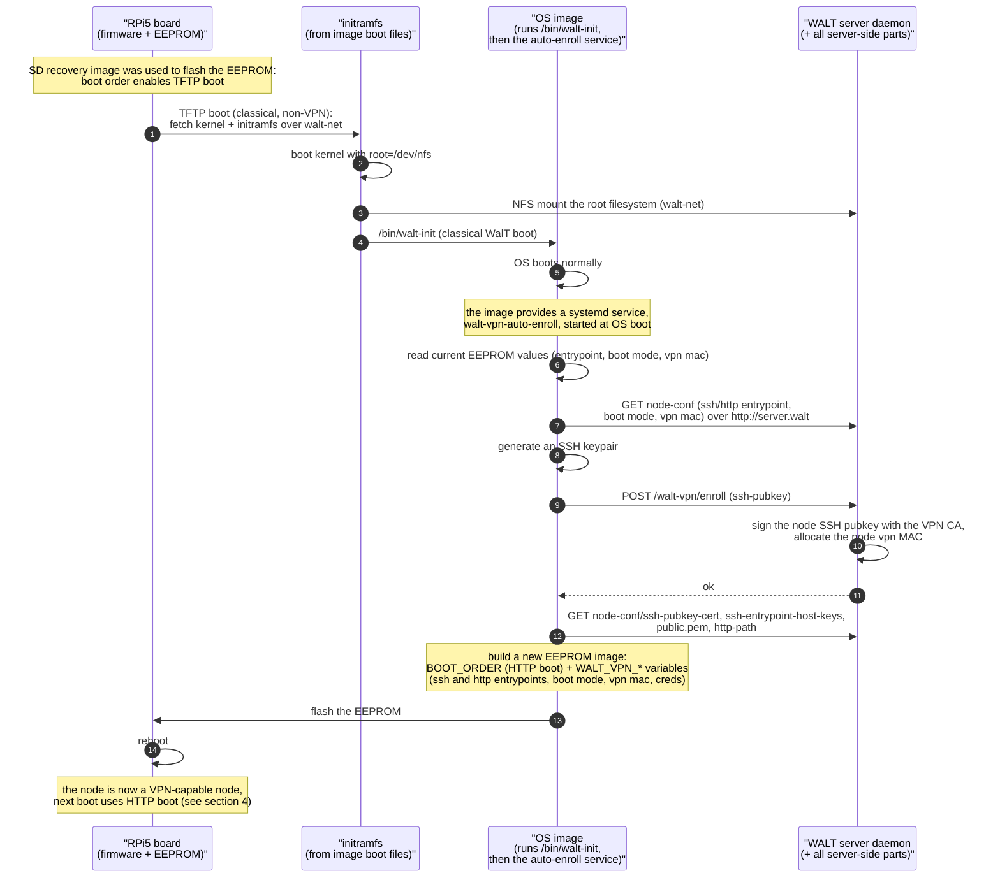
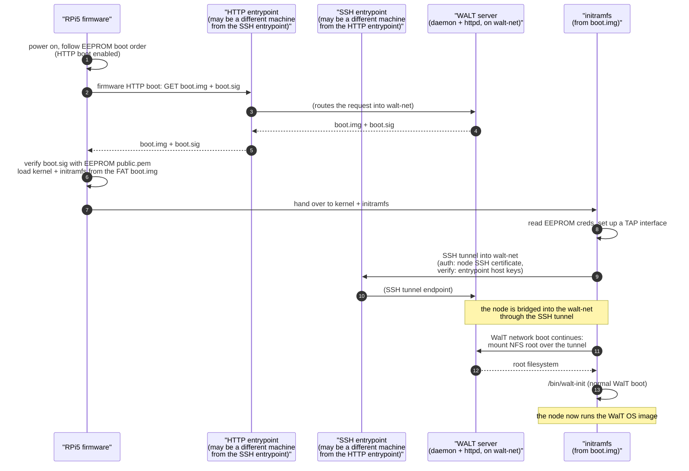
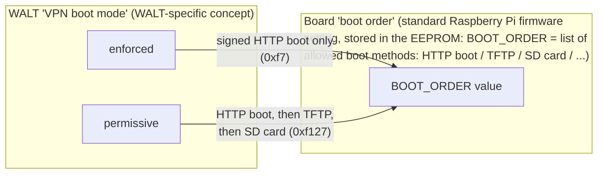

# WALT VPN node (Raspberry Pi 5B) boot — diagrams

These diagrams describe how a WALT VPN-capable Raspberry Pi 5B boots, how the
server prepares and exposes the boot material, and how an RPi5 gets enrolled as
a VPN node.

Key source references (WALT server):
- `server/walt/server/mount/setup.py` → `generate_boot_sig()`, `setup()`
- `server/walt/server/exports/exports.py`, `server/walt/server/exports/ops/mounts.py`
- `server/walt/server/processes/main/network/tftp.py`
- `server/walt/server/services/httpd/httpd.py`
- `server/walt/server/processes/main/vpn.py` → `enrollment()`
- `server/walt/server/setup/vpn.py`
- doc: `doc/walt/doc/md/vpn-security.md`, `vpn.rst`, `node-bootup.md`

The *OS-image* side of the mechanism (enrollment service, `boot.img`
maintenance) is covered in the `walt-images` build tree (section 6).

---

## 1. Deployment context

A WalT server runs on the local "walt-net" LAN. A VPN-capable RPi5 node may be
located in that same LAN, or physically moved to a distant site and connected
through the Internet / a corporate network. In the latter case the node does
not reach the WalT server directly: it goes through small, hardened
**entrypoints** (HTTP and SSH), which forward traffic into the walt-net.

Read from left to right: node → entrypoints → server.

### Only the *start* of the boot differs

Whether the node is a VPN node or not, once its OS is running the boot
procedure is identical (NFS root, `/bin/walt-init`). Only the very beginning —
how the kernel and initramfs are fetched and how the node reaches the walt-net —
differs:

### Raspberry Pi firmware boot methods — no ipxe

We make no use of ipxe here (ipxe is only used by pc-x86-64 WalT nodes). For the
RPi5 we simply rely on the boot methods built into the Raspberry Pi firmware
(publicly documented):

- **SD-card boot** — used to recover a board;
- **TFTP boot** — used for the classical, non-VPN WalT boot procedure of an RPi5
  on the walt-net;
- **HTTP boot** — used once the RPi5 is enrolled as a VPN node.

HTTP boot requires the server to serve two files, `boot.img` and `boot.sig`:

- `boot.img` is a **FAT-formatted file archive** that contains the same kind of
  files a Raspberry Pi finds on its SD card (kernel, initramfs, config, ...).
  Because it is only fetched over HTTP, it **must contain no secret**.
- `boot.sig` is the RSA signature of `boot.img`, produced by the WalT server
  with the private HTTP boot key. The board verifies it with the corresponding
  public key stored in its EEPROM.

---

## 2. Boot files: prepared, signed, and served

One OS image is used for all RPi models it supports. For an RPi5 to boot over
HTTP, the image's boot directory must contain `boot/rpi-5-b/boot.img` (a FAT
archive) and a `boot.sig` (its signature). This section shows how the WALT user,
the server daemon, the server httpd, and the WALT node interact to prepare,
sign, and serve these two files.

Notes:

- The signature is computed **once when the image is mounted** and stored as a
  static `boot.sig` next to `boot.img` (`generate_boot_sig()`,
  `mount/setup.py`). The firmware does not re-sign; it only verifies.
- The HTTP boot keys are an RSA-2048 key pair at
  `/var/lib/walt/http-boot/private.pem` + `public.pem` (generated by the
  server; see `const.py`). `public.pem` is what the board ultimately stores in
  its EEPROM to verify `boot.sig`.
- The `boot.img` FAT file itself is maintained by the **OS image** (see
  section 6), not by the server. The server only signs whatever `boot.img` is
  present.

---

## 3. First boot of an RPi5 and VPN enrollment

For an RPi5 to become a VPN-capable node it must be booted **at least once on
the walt-net** using the classical (non-VPN) WalT boot procedure. Being
*inside* the walt-net is what lets it reach the server and complete
enrollment.

Please note: before enrollment, the node **is not able to HTTP-boot**. Like any
non-VPN-capable board, it starts by **TFTP booting** from the walt-net.

To prepare a brand-new board, one first flashes it (e.g. with the WalT
SD-card recovery image). Doing so **resets the board's EEPROM boot order**,
enabling the **TFTP boot** method, so the board can boot using the classical
WalT boot procedure from the walt-net.

The SSH entrypoint and the HTTP entrypoint are both written to the EEPROM, as
two distinct host names — they may be the same machine or different machines.

---

## 4. VPN boot of an RPi5 (subsequent boots)

Once enrolled, at every boot the RPi5 *HTTP-boots* `boot.img` + `boot.sig`,
and then opens an SSH tunnel through the SSH entrypoint so that the regular
WalT network boot (NFS root) can continue over the walt-net. The HTTP and SSH
entrypoints may be the same or different machines, as shown below.

---

## 5. VPN boot mode versus board boot order

These two notions are related but distinct:

- **VPN boot mode** (`enforced` / `permissive`) is a **WALT-specific notion**,
  a per-node setting managed on the WalT server.
- **Boot order** is a **standard Raspberry Pi firmware setting**, stored in the
  EEPROM, that lists the boot methods the firmware is allowed to try (SD card,
  TFTP, HTTP boot, ...).

They are connected through the EEPROM programming: when an RPi5 enrolls or when
its VPN settings change, the node (via the auto-enroll service) translates the
WALT *VPN boot mode* into a standard firmware *boot order* and flashes it.

When do these settings get (re)flashed?

- At **enrollment** (section 3): a first EEPROM image is written.
- Later, when the **VPN settings change on the server** (entrypoints, boot
  mode), on the next classical boot of the node the auto-enroll service
  compares the server's `node-conf` with the current EEPROM values and, if they
  differ, flashes a new EEPROM image to apply the new entrypoints / boot mode.
- The firmware then uses the boot order at each power-on.

---

## 6. What the OS image must provide

A nontrivial part of the boot procedure lives **inside the OS image**: the
initramfs is part of the image, and so are the boot files and the enrollment
service. This means the OS image is not a passive payload — it must be built
with RPi5 VPN support.

The default WalT OS images for RPi5 nodes (`rpi64-debian`) are built from the
`walt-images` repository (Dockerfile `base/rpi64/debian/Dockerfile`, overlay
`overlays/rpi64-debian`). Concretely, the image contributes:

- **A systemd service** `walt-vpn-auto-enroll.service`
  (`overlays/rpi64-debian/etc/systemd/system/...`, script
  `usr/bin/walt-vpn-auto-enroll`). Started once the OS is booted, it performs
  enrollment (section 3) and re-flashes the EEPROM when VPN settings change
  (section 5). It runs only on real hardware, not in `walt image shell`.
- **`/boot/update-boot-files.sh`** (`overlays/rpi64-debian/boot/...`), which
  builds the `boot.img` FAT archive for HTTP boot from the RPi boot files, and
  keeps it up to date:
  - at image build time, to produce the shipped image;
  - automatically, so that when a WALT user modifies a running OS image (e.g.
    with `walt image shell <image>` then `apt upgrade` to change the kernel or
    initramfs, or edits boot files in `<image>:/boot/rpi-5-b/`), `boot.img` is
    regenerated to reflect those changes without the user needing to know about
    the mechanism. When such an updated image is later mounted, the server
    (re)signs it (section 2).
- **Boot files** under `<image>:/boot/rpi-5-b/` (kernel, initramfs, firmware
  config, `cmdline`...), gathered into `boot.img`.

### Third-party images may not support RPi5 VPN boot

Because an important part of the mechanism lives inside the OS image, some
third-party WALT images may **not** support RPi5 VPN booting. Such an image can
usually still be booted **only from the walt-net** (classical TFTP boot); it
just cannot provide the HTTP boot / enrollment / tunnel pieces described above.

---
