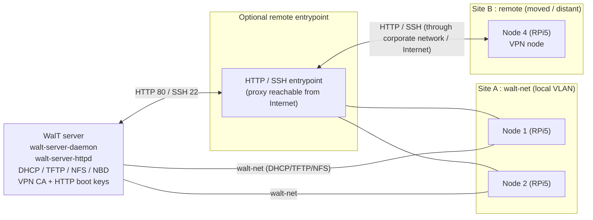
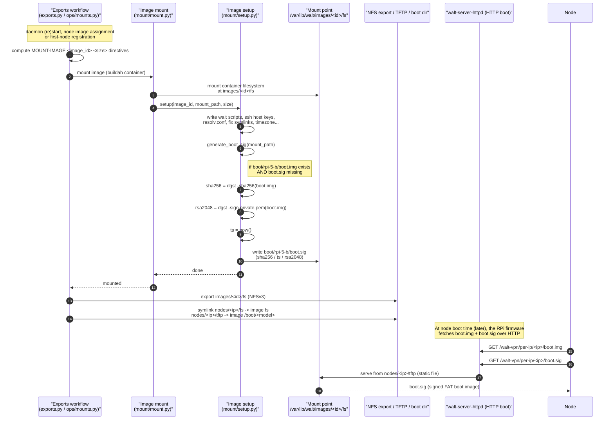
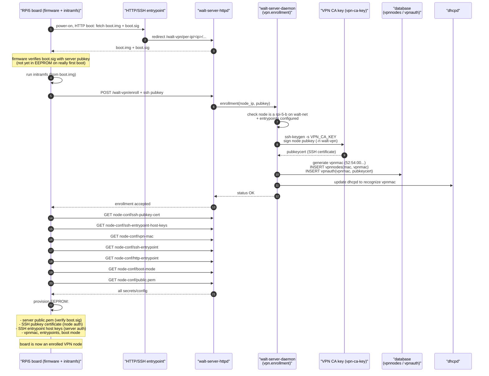
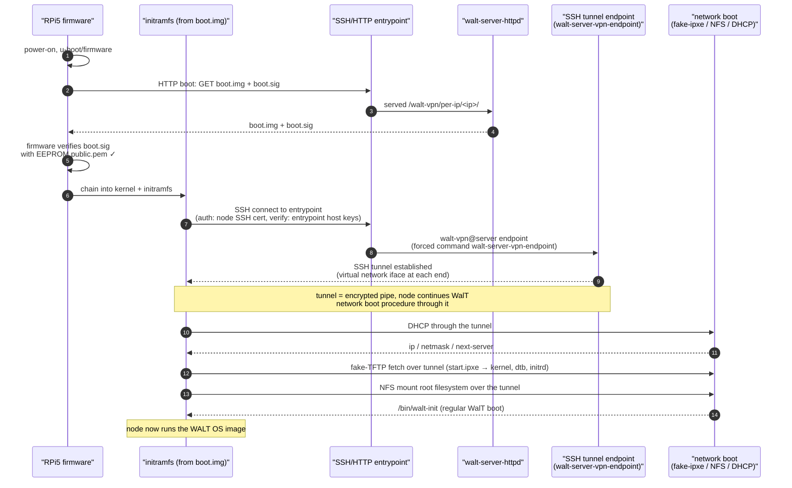
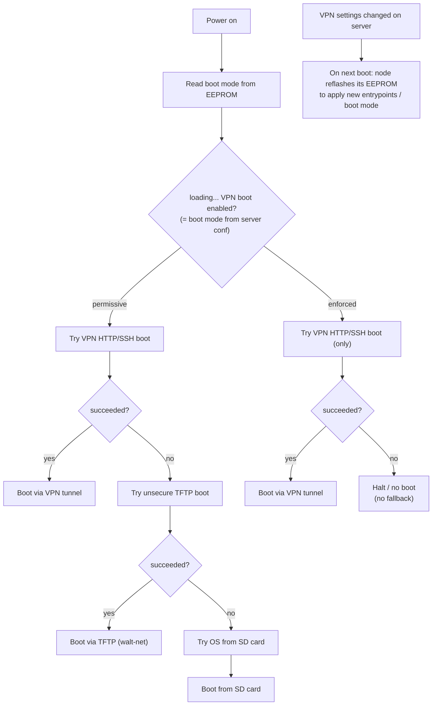

# WALT VPN node (Raspberry Pi 5B) boot — diagrams

> Branch: `etienne-dev`. These diagrams describe how a WALT VPN-capable
> Raspberry Pi 5B boots, and how the server prepares/exposes the boot material.
>
> Key source references:
> - `server/walt/server/mount/setup.py` → `generate_boot_sig()`, `setup()`
> - `server/walt/server/exports/exports.py`, `server/walt/server/exports/ops/mounts.py`
> - `server/walt/server/processes/main/network/tftp.py`
> - `server/walt/server/services/httpd/httpd.py`
> - `server/walt/server/processes/main/vpn.py` → `enrollment()`
> - `server/walt/server/setup/vpn.py`
> - doc: `doc/walt/doc/md/vpn-security.md`, `vpn.rst`, `node-bootup.md`

---

## 1. Deployment context

Notes:
- VPN nodes can boot **either** on `walt-net` **or** through an HTTP/SSH
  entrypoint (usually the server itself, by default).
- The VPN is limited to Raspberry Pi 5B boards (`rpi-5-b`).
- On `walt-net`, HTTP traffic to any VPN HTTP entrypoint is caught by the
  server's own `WALT-DNAT` chain and handled locally
  (`processes/main/vpn.py::prepare/update_vpn_dnat`).

---

## 2. Server side: mounting an OS image, signing the bootable FAT image and exposing it

This answers *"when the server signs the bootable FAT image (i.e. when the OS
image is mounted and exposed on the network for booting)"*.

Mermaid sequence of what happens **before** a node can boot, triggered when the
daemon reconciles exports (at startup, or when a node's image assignment /
registration changes and the image must be mounted):

Key points:
- The signature is computed **once at mount time** and stored as a static
  `boot.sig` next to `boot.img` in the image boot directory
  (`mount/setup.py:210-229`). This differs from `master`, where `boot.sig`
  used to be computed on-the-fly on each HTTP request.
- The HTTP boot keys are an RSA-2048 key pair at
  `/var/lib/walt/http-boot/private.pem` + `public.pem` (`const.py`,
  generated by the server). `public.pem` is what the board ultimately stores
  in its EEPROM to verify `boot.sig`.
- `boot.img` is a FAT image (kernel + initramfs) that **contains no secrets**,
  hence it is safe over plain HTTP.

---

## 3. First boot: enrollment & secrets provisioning into the EEPROM

Sequence for a fresh RPi5 board connecting so that it gets enrolled as a VPN
node and stores the VPN secrets in its EEPROM:

Notes:
- On re-enrollment (e.g. EEPROM was reset / `rpi-5-sd-recovery.tar.gz`), the
  stored SSH certificate is simply updated (`UPDATE vpnauth`), keeping the
  same `vpnmac`.
- The EEPROM has no TPM; the secrets are readable by anyone with a shell on
  the node. Mitigation: the WALT image for RPi5 only allows remote login from
  the WALT server, so secrets are only exposed to WALT users
  (`processes/main/vpn.py` header comment, `vpn-security.md`).
- Changes in VPN settings (entrypoint, boot-mode) cause the board to
  **reflash its EEPROM automatically on next boot**.

---

## 4. Normal (subsequent) VPN boot over the SSH tunnel

Sequence for an enrolled node, subsequent boots, **VPN path**:

- For a node booting **on `walt-net`**, the HTTP entrypoint may not be
  reachable (unless `netsetup=NAT`); the server catches the HTTP boot traffic
  via the `WALT-DNAT` firewall rules and handles it locally.
- Even on `walt-net`, an SSH connection is still attempted to
  `walt-vpn@server.walt` to verify the server is legitimate (guards against a
  crafted network named "walt").

---

## 5. Boot-mode decision & EEPROM reflash (activity)

What the board does regarding which boot procedure to allow, and when it
updates its EEPROM:

Notes:
- **enforced**: only the VPN procedure is allowed (recommended for public /
  untrusted locations).
- **permissive**: VPN → TFTP → SD-card fallback.
- Regardless of mode, the board reflashes its EEPROM to reflect any VPN
  settings change.
- EEPROM can always be reset out-of-band with an SD card +
  `rpi-5-sd-recovery.tar.gz`, returning the board to a "new / unenrolled"
  state.

---

### Cross-references for discussion
- Where the FAT boot image is signed at mount time: `mount/setup.py:210-229`.
- Where mounted images are exposed (NFS + node `tftp`/`fs` symlinks + HTTP):
  `exports/exports.py`, `processes/main/network/tftp.py`,
  `services/httpd/httpd.py:serve_node_boot_file`.
- Where enrollment + SSH-cert signing + vpnmac allocation happens:
  `processes/main/vpn.py:142 enrollment()`.
- VPN CA / endpoint / KRL setup: `setup/vpn.py`.
- HTTP boot keys: `const.py`, `processes/main/server.py` (generation).
